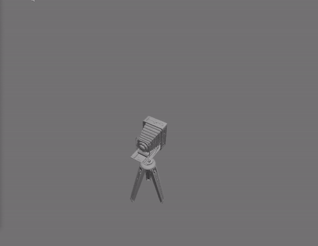
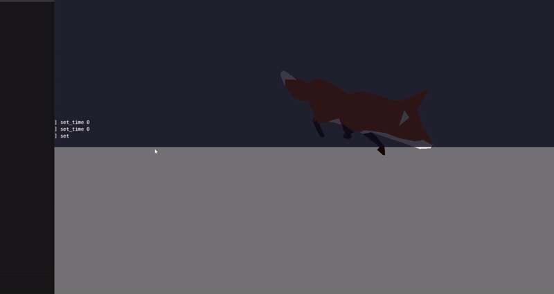
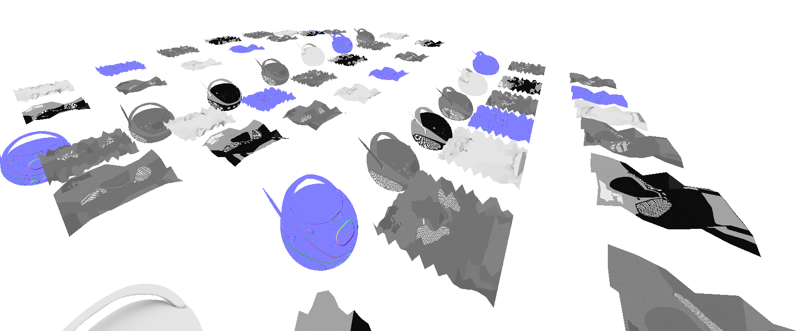
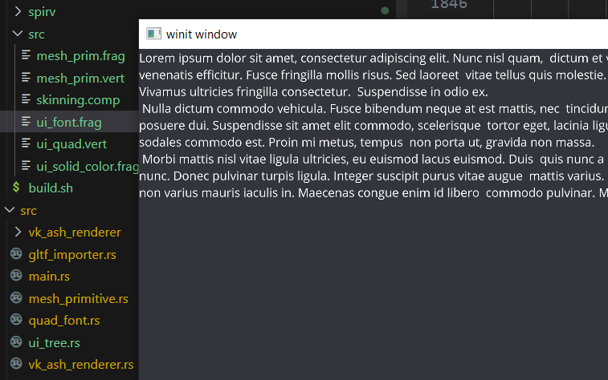

# Basic Vulkan Render Engine
Simple library and application code for rendering GLTF meshes on the GPU via Vulkan. Uses Rust and a whole lot of code.

# Basic Features
### Normal Map Support
GLTF normal map importing. Normal map lighting implemented with fragment shader.

### Mesh Skinning and Animation
Implemented with compute shaders. Includes GLTF animation importing and playback.

### Complex Instancing
Batched rendering of many objects of different geometries and textures.

### Text Rendering
SDF fragment shader rendering with font import support.

